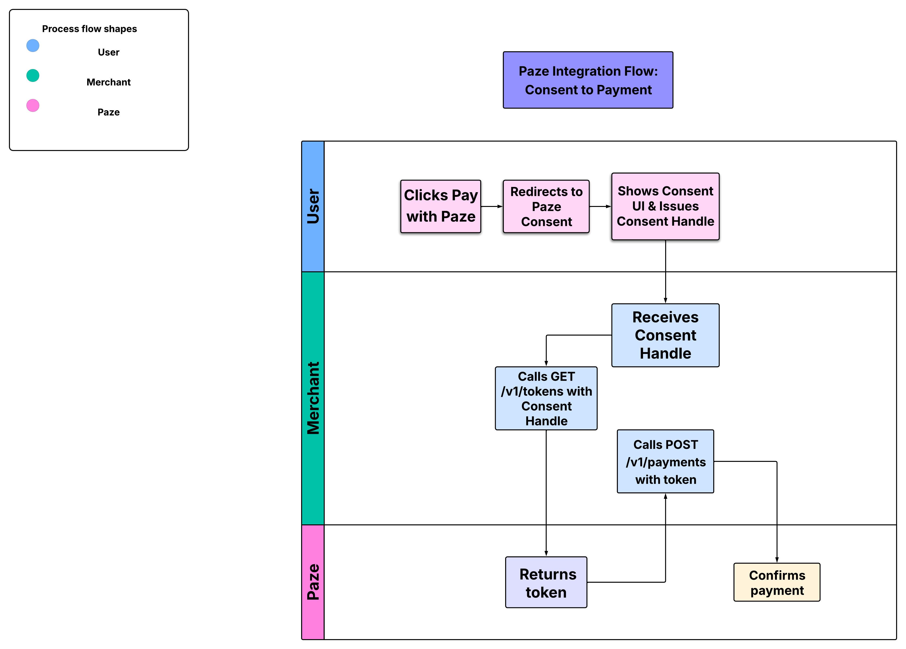
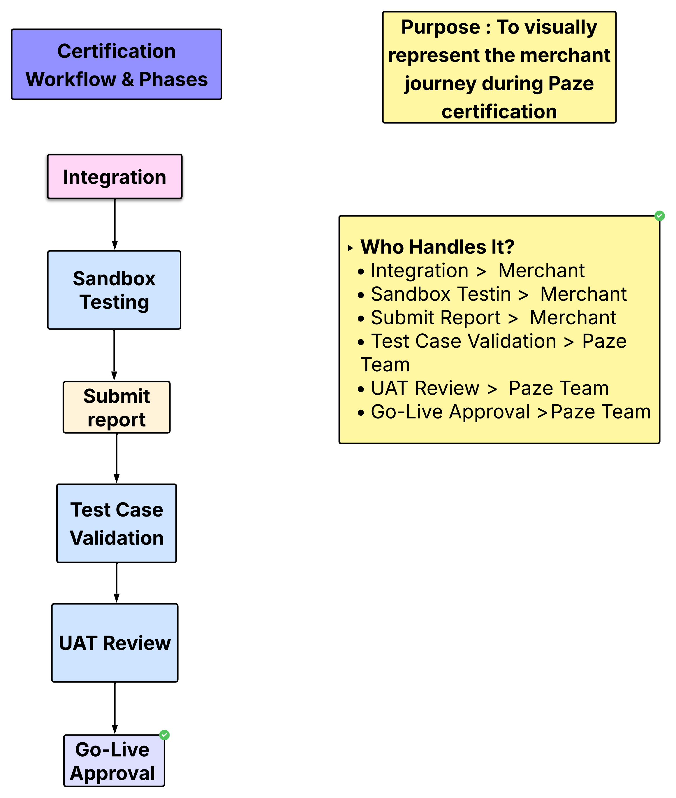

# Paze Integration & Certification – Understanding Document

# Paze Integration – Summary Overview

This document provides a complete technical and procedural understanding of integrating with **Paze**, a digital wallet and checkout service.

It covers:
- ✅ The **Consent-to-Payment flow** with APIs
- ✅ The **Certification workflow & phases**
- ✅ Key API endpoints, environments, and UI requirements
- ✅ Diagrams to visually represent both the technical and certification journeys

It is intended for developers and stakeholders involved in:
- Integrating Paze into a merchant platform
- Undergoing Paze certification
- Reviewing technical readiness before go-live

---

## 1. Introduction

This document provides a detailed understanding of how to integrate with **Paze**, a digital wallet service designed to streamline secure online payments.

The integration involves:
- Understanding the sequence of API calls for onboarding, authentication, and transaction execution.
- Aligning with Paze’s architecture, token flow, and consent mechanisms.
- Preparing for certification by adhering to defined environments, branding, and compliance standards.

This understanding is based on the documentation provided during the Discovery Workshop and Paze’s Certification Guide. The goal is to ensure a clear picture of both the technical and procedural requirements for a successful integration.

## 2. API Integration Overview

The Paze integration consists of a series of REST-based APIs that support user onboarding, authentication, tokenization, and transaction flows. These APIs are grouped into functional areas as follows:

### 🔹 2.1 Onboarding & Consent Flow

- **Paze Consent Flow**: The customer is redirected from the merchant site to Paze’s consent interface.
- **Paze returns a Consent Handle**: This handle is used to track and complete the onboarding.
- The merchant must **poll Paze** using this handle to retrieve the token once the user completes consent.

> 🧠 *Think of the Consent Handle like a session ID for the user's approval process.*

#### 🖼 Consent-to-Payment API Flow (Diagram)

Below is a visual representation of the full user-to-payment journey, including Consent Handle and token usage:

**Steps in the diagram:**
1. User clicks “Pay with Paze”
2. Merchant redirects user to Paze consent UI
3. Paze displays consent screen and captures user approval
4. Paze issues a Consent Handle (sent back to Merchant via redirect URI)
5. Merchant calls GET /v1/tokens with the Consent Handle
6. Paze returns a Token representing the user’s approval
7. Merchant calls POST /v1/payments using the Token
8. Paze processes and confirms the payment

### 🔹 2.2 Token Retrieval

Once consent is granted, the merchant uses the `GET /v1/tokens` endpoint to retrieve the **Paze token** tied to the user.

- This token is used in subsequent payment-related API calls.
- It represents authorization to act on behalf of the user.

### 🔹 2.3 Transaction Flow

The typical steps in a Paze transaction are:

1. **Initiate Payment**: Merchant calls `POST /v1/payments`
2. **Redirect to Paze**: User confirms the transaction
3. **Polling/Callback**: Merchant waits for confirmation (via webhook or polling)
4. **Transaction Complete**

### 🔹 2.4 Key API Endpoints Summary

| Purpose                  | Method & Endpoint           |
|--------------------------|-----------------------------|
| Initiate Consent Flow    | `POST /v1/consent`          |
| Retrieve Token           | `GET /v1/tokens`            |
| Initiate Payment         | `POST /v1/payments`         |
| Transaction Status       | `GET /v1/payments/{id}`     |
| Cancel Payment           | `POST /v1/payments/{id}/cancel` |

### 🔹 2.5 Error Handling

- All APIs return HTTP status codes (`200`, `400`, `401`, `500`) with detailed error messages.
- Merchants must handle and display meaningful messages to users during failures.

### 🔹 2.6 Authentication

All API calls are authenticated using:
- `client_id`
- `client_secret`
- Optional: JWT or OAuth2 token depending on the environment and stage.

## 3. Certification Process Overview

To go live with Paze, all merchants must go through a structured **certification process** to validate their integration, UI behavior, and compliance.

This ensures:
- The customer experience is seamless
- Security and data handling requirements are met
- Technical behavior matches Paze’s expected flows

---

> 📊 The diagram below illustrates the key steps and flow in the Paze certification process:

### 🔹 3.1 Certification Phases

| Phase              | Description |
|-------------------|-------------|
| **Integration**   | Initial API integration and local testing in sandbox |
| **Sandbox Testing** | Execute test scenarios using provided test data and mock users |
| **Test Case Validation** | Follow official certification checklist provided by Paze |
| **UAT Review**     | Paze team reviews UI, API logs, and flow |
| **Go-Live Approval** | Final validation to move into production environment |

---

### 🔹 3.2 Prerequisites

Before certification begins, you must:
- Complete onboarding integration (consent + token flow)
- Integrate all core APIs (token, pay, cancel, status)
- Implement error handling and logging
- Prepare your UI flow for customer consent

---

### 🔹 3.3 Test Scenarios

Merchants are expected to execute a set of certification test cases including:

- Consent flow success & fail
- Token retrieval with valid/invalid users
- Payment initiation, cancellation, and status check
- Handling of expired/invalid tokens
- Display of branding and consent confirmation

A test report is submitted to Paze for review.

---

### 🔹 3.4 Certification Support

- Paze provides:
  - Sandbox credentials
  - Mock users / test PANs
  - Sample payloads
- You may be asked to **demo your integration** via video or live walkthrough
- Paze team will share feedback and approve fixes if needed

---

### 🔹 3.5 After Certification

Once approved:
- Merchant receives **Production credentials**
- URLs are updated to `paze.com` production endpoints
- Monitoring and SLA tracking begins

---

## 4. Environments (Sandbox, CAT, Production)

Paze supports multiple environments to help merchants integrate, test, and certify their flows before going live.

### 🔹 4.1 Sandbox Environment (Dev/QA)

- Used for initial integration and developer testing.
- Simulates customer consent, token generation, and payment without real transactions.
- Often includes **mock** or **stubbed responses**.

| Environment | URL Example                     |
|-------------|----------------------------------|
| Sandbox API | `https://sandbox.paze.com/api`  |
| Consent UI  | `https://sandbox.paze.com/consent` |

> Merchants use static test data (test user profiles, fake PANs, etc.) in this stage.

---

### 🔹 4.2 Certification (UAT)

- Used to validate the **end-to-end integration** against Paze's test plans.
- Requires real-time testing with Paze’s QA/certification team.
- Includes UI compliance and consent flow validation.

---

### 🔹 4.3 Production

- Final live environment for real customers.
- Must only be accessed after successful certification.
- Uses live credentials and real customer data.

| Environment | URL Example                     |
|-------------|----------------------------------|
| Production API | `https://api.paze.com`       |
| Consent UI     | `https://paze.com/consent`   |

---

### 🔐 Credentials and Secrets

- Each environment uses its own `client_id`, `client_secret`, and security setup.
- You must **never share production secrets** during test or sandbox runs.

## 5. Branding & UI Guidelines

To maintain a consistent and trustworthy user experience, Paze requires all merchants to follow branding guidelines during integration and certification.

These guidelines ensure that:
- The **Paze brand is clearly represented**
- Users trust the consent and payment experience
- Merchants do not misrepresent or alter core UI elements

---

### 🎨 5.1 Logo & Usage

- Paze will provide **official logos and design assets**
- Logos must be placed:
  - On the **consent screen** (where user chooses to proceed with Paze)
  - During **transaction confirmation** (if applicable)
- Logos must not be stretched, recolored, or modified

---

### 💻 5.2 Consent Flow UI

- The merchant must present a **“Pay with Paze”** or equivalent CTA (call-to-action)
- After user clicks this CTA:
  - Redirect to Paze's hosted consent screen (not embedded)
  - Show spinner or progress indicator during redirection
- Do not capture or simulate the Paze consent screen on your own UI

---

### 📱 5.3 Device Compatibility

- UI should be responsive across:
  - Desktop
  - Mobile (iOS and Android)
- Test must include different viewports to ensure layout doesn’t break

---

### ✅ 5.4 UI Validation During Certification

Paze team will validate:
- CTA button placement and label
- Proper use of branding assets
- Proper redirection behavior and return handling
- Fallback or error flows (e.g., user cancels consent)

You may be required to share:
- Screenshots or recordings of the flow
- Live demo or guided walkthrough

> Merchants failing branding checks will need to revise and resubmit UI flows.
---

## 6. Key Considerations

These are important integration-level concerns developers must account for when working with Paze APIs.

---

### 🔐 6.1 Security & Authentication

- All APIs are protected and require secure `client_id` and `client_secret`.
- In production, API calls must be made over **HTTPS only**.
- Tokens (such as `access_token`, `consent_handle`) should be securely stored and never exposed to client-side apps (e.g., frontend code).

---

### 🔁 6.2 Token Lifecycle

- Paze tokens are time-bound and may expire.
- Merchants should **handle token refresh** flows as required.
- If a token is expired or invalid, the merchant must prompt re-authentication or re-initiate consent.

---

### ⚠️ 6.3 Error Handling Best Practices

- Always check HTTP status codes (`200`, `400`, `401`, `500`, etc.)
- On error, log the full response (excluding sensitive info) for diagnostics.
- Examples:
  - `401 Unauthorized`: usually due to invalid or expired credentials
  - `400 Bad Request`: malformed request body or missing fields

---

### 🛡 6.4 Compliance and Logging

- All requests and responses (headers, body, timestamps) should be logged for audit purposes — **excluding PII or PAN data**.
- This helps during certification and issue tracking.

---

### 📦 6.5 Retry Mechanism (if needed)

- For non-idempotent operations (e.g., `POST /payments`), ensure retries are managed safely to avoid duplicate transactions.
